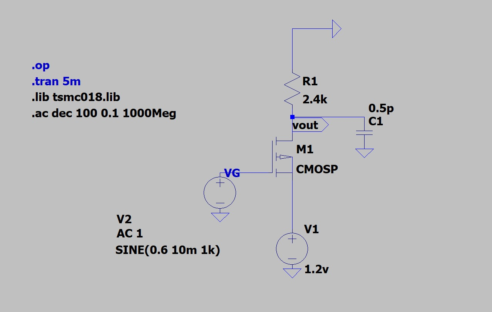
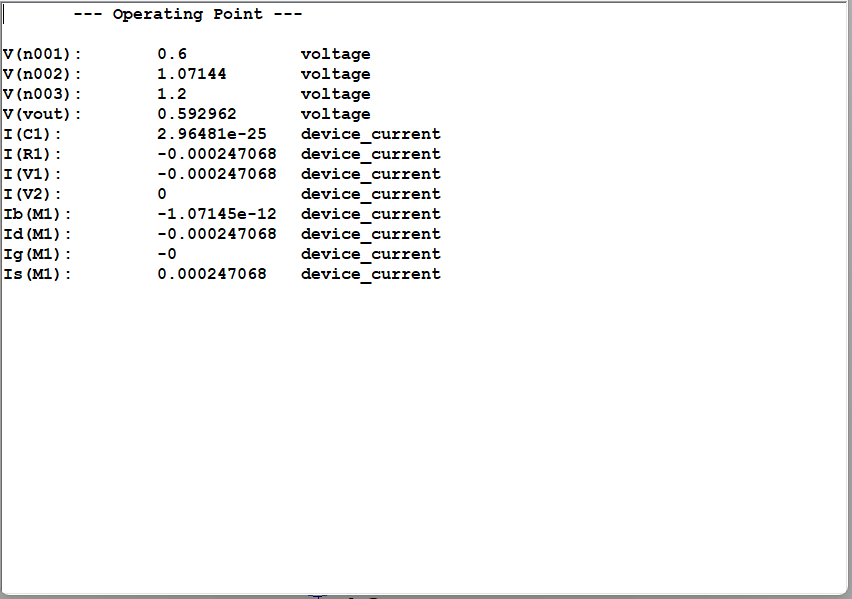
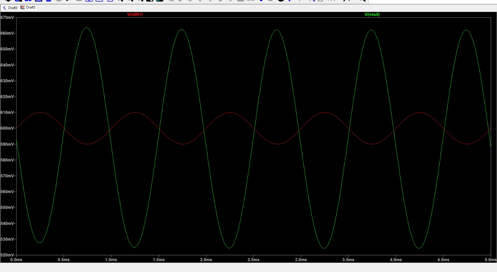
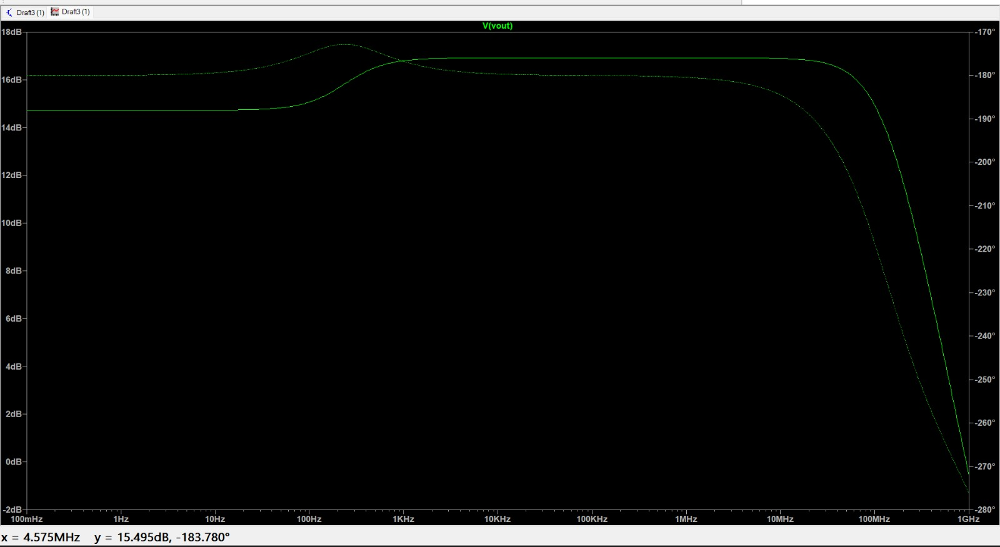

# EXPERIMENT 01

# AIM
Design a PMOS Common Source (CS) amp using 180nm CMOS technology and have power and voltage limits and characterize the performance of the designed circuit using:
VDD=1.2V                P<=0.4mW                CL=0.5pF                 Ln=360nm

1. DC Operating Point Analysis

2. Transient Analysis

3. AC Small-Signal Analysis

using LTspice.

# COMPONENTS REQUIRED

1. PMOS transistor (TSMC 180nm model)

2. Resistor Rd

3. DC voltage source

4. Signal voltage source

5. Capacitor 
 
# THEORY

The foundations of a contemporary electronic system/ IC are the Metal-oxide-semiconductor Field-effect transistor (MOSFET). The MOSFETs are widely used due to their:

1. Small dimension and simple design.

2. Low power consumption

3. High input impedance

4. The VLSI technology is highly scaled.

MOSFET may be built in either NMOS or PMOS and may be employed in 3 basic amplifier design:

1. Common Source (CS)

2. Widely Spread (Source Follower)

3. Common Gate (CG)
The most popular of these is the Common Source arrangement which is applied in the design of analog circuits as it has large voltage gain and signal inversion.

# PMOS is operated in Saturation Region.

The amplifying PMOS transistor must be saturated in the saturation region whereby it is a voltage controlled current source.

Under saturation conditions in PMOS transistor:

VSG > |VT|

VSD ≥ VSG − |VT|

VSG = Source-to-Gate voltage

VSD = Source-to-Drain voltage

VT  = Threshold voltage of PMOS

VOV = VSG − |VT|   (Overdrive voltage)

When these conditions are satisfied, the PMOS transistor operates in saturation and enables linear amplification.

# PROCEDURE

1. Include Technology Model
 The library file TSMC 180nm was included in LTspice with the.lib directive.

2. Build the PMOS CS Circuit.
 The Common Source amplifier was built using the PMOS Common Source which involved connection:

Source to VDD (1.2 V)

Drain to a load resistor

Gate to a DC bias with AC input

Body tied to source

Load capacitor at the output

3. Initial Device Parameters
The channel length in PMOS was the fixed constant which was 360 nm and an initial width value was picked.

4. DC Operating Point Analysis
The following command op was run to get the current through the drain and the voltage at the output.

5. Bias Adjustment that is needed.
The width of the PMOS was adjusted progressively until the required drain current and output voltage was obtained with the specified power constraint.

6. Saturation Verification
The saturation condition was confirmed so as to check the functioning of the amplifier.

7. Transient Analysis
 DC-shifted sinusoidal input signal was applied and .tran analysis was done to monitor the time domain amplification and phase inversion

8. AC Small-Signal Analysis
The AC amplitude was adjusted to 1 V and the.ac analysis was done to receive voltage gain and frequency response.

9. Result Comparison
Theoretical calculations were compared to simulation results to prove the design of the amplifier

# DESIGN CALCULATIONS
There is need to compute the anticipated operating conditions of the PMOS Common Source amplifier before the simulation is conducted.
Such calculations are useful in choosing the correct bias values, and in ensuring that the transistor will be in the saturation region of operation.

# 1. Determination of Drain Current from Power
Given power constraint:

P <= 0.4 mW

VDD = 1.2 V

The DC power consumed by the circuit is:

P = VDD × ID

Therefore,

ID = P / VDD

ID = 0.4 × 10^-3 / 1.2   = 0.333 mA

To maintain a safety margin and avoid exceeding the power limit, a design current of:

ID ≈ 250 uA

# 2. Calculation Of PMOS Width (W)

To determine the required width of the PMOS transistor for the chosen drain current, the saturation current equation for PMOS is used:

up = 0.0115689 m^2/V·s

Cox = 0.0084207 F/m^2

L = 360 nm = 360 × 10^-9m

VOV = 0.2094 V

ID = 250 uA = 250 × 10⁻^-6A

ID = (1/2) × up × Cox × (W/L) × (VOV)^2

W = 42 u

# 3. Selection of Output Voltage

VD ≈ VDD / 2

VD ≈ 1.2 / 2

VD = 0.6 V

# 4. Calculation of Drain Load Resistance

Using Ohm’s law:

RD = VD / ID

RD = 0.6 / (250 × 10^-6)

RD = 2400 ohm

RD = 2.4 kilo-ohm

Thus, a drain resistor of 2.4 kΩ is selected.

# 5. Determination of Gate-Source Voltage and Overdrive Voltage

The threshold voltage magnitude is:

|VT| = 0.3906 V

To ensure saturation operation, choose:

VSG ≈ 0.6 V

Overdrive voltage is:

VOV = VSG − |VT|

VOV = 0.6 − 0.3906

VOV = 0.2094 V

# 6. Calculation of Gate Voltage

Since the source of the PMOS is connected to:

VS = 1.2 V

The required gate voltage is:

VG = VS − VSG

VG = 1.2 − 0.6

VG = 0.6 V

# 7. Verification of Saturation Condition

For PMOS saturation:

VSD >=VOV

First calculate VSD:

VSD = VS − VD

VSD = 1.2 − 0.6

VSD = 0.6 V

Since:

0.6 V > 0.2094 V

# The PMOS transistor operates in the saturation region.Final Calculated Values

Drain Current (ID) = 250 uA

Output Voltage (VD) = 0.6 V

Drain Resistor (RD) = 2.4 kohm

Gate Voltage (VG) = 0.6 V

Overdrive Voltage (VOV) = 0.2094 V

Saturation Condition = Verified

# CIRCUIT

# DC ANALYSIS

DC analysis is performed to determine the operating point (Q-point) of the MOSFET and to ensure that the transistor operates in the saturation region, 
which is necessary for proper amplification. Establishing a correct bias point prevents signal distortion and ensures linear operation of the amplifier.

This analysis helps in:

1. Verifying that the MOSFET satisfies saturation conditions

2. Determining drain current and output voltage

3. Selecting appropriate biasing components

4. Maintaining stable circuit operation against parameter variations

By fixing the DC operating point correctly, the amplifier achieves maximum performance, reliability, and signal integrity.

# Q-POINT VERIFICATION USING DC OPERATING POINT ANALYSIS

After calculating the theoretical PMOS width as W = 42 um, DC operating point analysis was performed using the .op command in LTspice to verify the bias point.

The obtained simulation results were:

Drain current, ID = −0.000149608 A (approximately 149 uA)

Output voltage, Vout = 0.359058 V

These values are significantly lower than the expected theoretical values:

Expected ID ≈ 250 uA

Expected Vout ≈ 0.6 V

The reduction in drain current and output voltage occurs due to short-channel effects and mobility degradation present in the realistic TSMC 180nm BSIM transistor model, which are not accounted for in the ideal square-law MOSFET equation.

# WIDTH ADJUSTMENT FOR REQUIRED OPERATING POINT

To achieve the desired drain current and output voltage, the PMOS width was gradually increased while keeping all other parameters constant.

After iterative adjustment, the width was set to:

W = 72 um

The DC operating point was re-evaluated using the .op command.

The new operating point obtained was:

Drain current, ID ≈ 247 uA

Output voltage, Vout ≈ 0.59 V

These values closely match the theoretical design targets

# TRANSIENT ANALYSIS

Transient analysis is used to study the circuit’s response to time-varying input signals. It provides insight into how the amplifier behaves in real-time operation.
This analysis helps in:

1. Observing signal amplification

2. Identifying phase inversion

3. Detecting distortion and waveform clipping

4. Studying dynamic response of the circuit

Transient analysis is especially important in high-speed and communication circuits, where accurate signal reproduction is essential.

# 1.Gain Calculation

In transient analysis, the voltage gain is calculated using both theoretical formulas and simulation waveform measurements.

# A.Theoritical Voltage Gain

For a Common Source amplifier:

Av = − gm × RD

First calculate transconductance:

gm = 2 × ID / VOV

Given:

ID = 250 uA

VOV = 0.2094 V

gm = (2 × 250 × 10^-6) / 0.2094

gm = 2.39 mS

Now calculate gain:

Av = gm × RD

RD = 2.4 kohm

Av = 0.00239 × 2400

Av = 5.736

Now convert to decibels:

Gain (dB) = 20 × log10(Av)

Gain (dB) = 20 × log10(5.736)

Gain (dB) = 15.16 dB

# B.Simulation Gain (From WaveForm)

From transient simulation:

input p-p = 20 mV

Output p-p = 136.05 mV

Voltage gain:

Av = Vout / Vin

Av = 136.05 / 20

Av = 6.8025

Now convert to dB:

Gain (dB) = 20 × log10(6.8025)

Gain (dB) = 20 × 0.8326

Gain (dB) = 16.65 dB

# C.Comparison

Theoretical Gain = 15.16 dB

Simulation Gain = 16.65 dB

The slight difference occurs due to:

• Channel length modulation

• Short channel effects

• Output resistance (ro)

# AC ANALYSIS – GAIN AND BANDWIDTH CALCULATION

AC analysis is performed to determine the frequency response of the PMOS Common Source amplifier. 
From the AC magnitude plot, the mid-band voltage gain is obtained from the flat region of the frequency response, and the bandwidth is determined using the −3 dB cutoff frequency.

# A.Mid Band Gain

From the flat portion of the AC magnitude plot:

Gain in dB = 16.912 dB

Convert to linear scale:

Av = 10^(Gain(dB)/20)

Av = 10^(16.912/20)

Av = 6.80 V/V

Thus, the mid-band voltage gain is:

Av ≈ 6.8 V/V

# B.Theoritical Bandwidth

The theoretical bandwidth of a single-pole amplifier is given by:

BW = 1 / (2 × π × RD × CL)

Given:

RD = 2.4 kΩ

CL = 0.5 pF

BW = 1 / (2 × π × 2400 × 0.5 × 10^-12)

BW = 132.63 MHz

# C.Simulation Bandwidth

From the AC response plot, the −3 dB cutoff frequency is observed at:

BW_simulation ≈ 131.8 MHz

This frequency corresponds to the point where the gain drops by 3 dB from the mid-band value.

# D.Unity Gain Bandwidth

For a single-pole amplifier, the gain-bandwidth product is constant and given by:

UGB = Av × BW

From AC analysis, Av = 6.8 and BW = 131.8 MHz,

hence:

UGB = 6.8 × 131.8 ≈ 896 MHz, which is close to the unity gain frequency observed in the plot (≈ 913 MHz).

# RESULT

The PMOS Common Source amplifier was successfully designed and simulated using TSMC 180 nm technology. The DC operating point obtained from simulation showed a drain current of approximately 247 µA and an output voltage of about 0.59 V, confirming proper biasing in the saturation region. Transient analysis demonstrated that the output signal was amplified and inverted with respect to the input, verifying common source operation. AC analysis provided a stable mid-band voltage gain of about 6.8 V/V (approximately 16.9 dB). The theoretical bandwidth was calculated as 132.6 MHz, while the simulated bandwidth was observed to be around 131.8 MHz. The unity gain bandwidth obtained from the frequency response was approximately 913 MHz, which closely matched the gain–bandwidth product.

# INFERENCE

The experimental results closely matched the theoretical calculations, validating the design approach of the PMOS Common Source amplifier. DC analysis confirmed saturation operation ensuring linear amplification. Transient analysis verified proper signal amplification with 180-degree phase inversion. AC analysis demonstrated expected gain and bandwidth characteristics of a single-pole amplifier. The close agreement between theoretical and simulated values highlights the effectiveness of combining analytical design with LTspice simulation. This experiment confirms the practical applicability of PMOS CS amplifiers in analog CMOS circuit design.

