# EXPERIMENT 02 CIRCUIT 01

# AIM

Design and analyze a **CMOS amplifier configuration using NMOS transistor with PMOS active load** using **TSMC 180 nm CMOS technology** and characterize the performance of the designed circuit under the following specifications:

| Parameter | Value |
|----------|------|
| Supply Voltage | **VDD = 1.2 V** |
| Drain Current | **ID = 250 µA** |
| Load Capacitance | **CL = 0.5 pF** |
| Channel Length | **L = 360 nm** |

The circuit performance is verified using:

- **DC Operating Point Analysis**
- **Transient Analysis**
- **AC Small Signal Analysis**

Simulation tool used: **LTspice**

---

# COMPONENTS REQUIRED

1. PMOS transistor (TSMC 180nm model)  
2. NMOS transistor (TSMC 180nm model)  
3. Source resistor RS  
4. DC voltage sources  
5. Signal voltage source  
6. Capacitor CL  

---

# THEORY

MOSFETs are the fundamental building blocks of modern integrated circuits. CMOS technology combines both **NMOS and PMOS transistors**, enabling high performance with low power consumption.

In this experiment, a **CMOS amplifier configuration** is designed where:

- **NMOS transistor acts as the amplifying device**
- **PMOS transistor acts as an active load**
- **Source degeneration resistor (RS)** stabilizes the bias point

Advantages of this configuration include:

- High voltage gain  
- Improved bias stability  
- Reduced distortion  
- High input impedance  

For proper amplifier operation, MOSFETs must operate in the **saturation region**, where they behave as voltage-controlled current sources.

---

# SATURATION CONDITIONS

## NMOS Saturation Condition

$$
V_{GS} > V_T
$$

$$
V_{DS} \ge V_{OV}
$$

Where

$$
V_{OV} = V_{GS} - V_T
$$

---

## PMOS Saturation Condition

$$
V_{SG} > |V_T|
$$

$$
V_{SD} \ge V_{OV}
$$

Where

$$
V_{OV} = V_{SG} - |V_T|
$$

---

# PROCEDURE

### 1. Include Technology Model

The TSMC 180 nm model library was included in LTspice using:

```
.lib tsmc018.lib
```

---

### 2. Build the CMOS Amplifier Circuit

The circuit consists of:

- PMOS transistor connected to **VDD**
- NMOS transistor connected to **source resistor**
- Output taken at the **drain node**
- Bias voltages applied to transistor gates
- Load capacitor connected at the output

---

### 3. Initial Device Parameters

The channel length was fixed as:

**L = 360 nm**

Initial width values were calculated theoretically.

---

### 4. DC Operating Point Analysis

The **.op command** was executed in LTspice to determine:

- Drain current  
- Output voltage  
- Node voltages  

---

### 5. Bias Adjustment

Transistor widths were adjusted until the required operating point was achieved:

**ID ≈ 250 µA**  
**Vout ≈ 0.8 V**

---

### 6. Transient Analysis

A sinusoidal signal was applied to the input and **.tran analysis** was performed to observe time-domain amplification.

---

### 7. AC Small Signal Analysis

AC magnitude was set to **1 V**, and **.ac analysis** was performed to obtain:

- Midband gain  
- Frequency response  
- Bandwidth  

---

# DESIGN CALCULATIONS

## 1. Drain Current Selection

The design drain current was selected as:

$$
I_D = 250\,\mu A
$$

---

## 2. Source Resistor Calculation

Voltage across the source resistor:

$$
V_{RS} = 0.2V
$$

Using Ohm’s law:

$$
R_S = \frac{V_{RS}}{I_D}
$$

$$
R_S = \frac{0.2}{250\times10^{-6}}
$$

$$
R_S = 800\Omega
$$

---

## 3. Output Voltage Selection

$$
V_{out} = \frac{V_{DD}}{2} + I_D R_S
$$

$$
V_{out} = 0.6 + 0.2
$$

$$
V_{out} = 0.8V
$$

---

## 4. Gate Bias Voltage

For NMOS:

$$
V_{GS} \approx 0.61V
$$

Source voltage:

$$
V_S = I_D R_S
$$

$$
V_S = 0.2V
$$

Therefore

$$
V_{B1} = V_{GS} + V_S
$$

$$
V_{B1} = 0.61 + 0.2
$$

$$
V_{B1} = 0.81V
$$

---

## 5. Device Dimensions

After theoretical calculations and iterative simulation adjustments:

| Parameter | Value |
|----------|------|
| NMOS Width | **Wn = 30 µm** |
| PMOS Width | **Wp = 128.5 µm** |
| Channel Length | **L = 360 nm** |

---

# CIRCUIT

<p align="center">
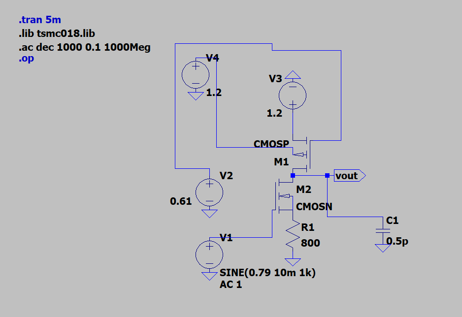
</p>

<p align="center">
<b>Fig 1: CMOS Amplifier Circuit</b>
</p>

---

# DC ANALYSIS

DC analysis determines the **operating point (Q-point)** of the MOSFET amplifier and verifies that the transistors operate in the **saturation region**.

---

# Q-POINT VERIFICATION USING DC OPERATING POINT ANALYSIS

Using the **.op command** in LTspice, the following values were obtained:

| Parameter | Value |
|----------|------|
| Drain Current | **ID ≈ 250 µA** |
| Output Voltage | **Vout ≈ 0.798 V** |

The theoretical output voltage was:

$$
V_{out} = 0.8V
$$

The simulated value closely matches the theoretical design target.

<p align="center">
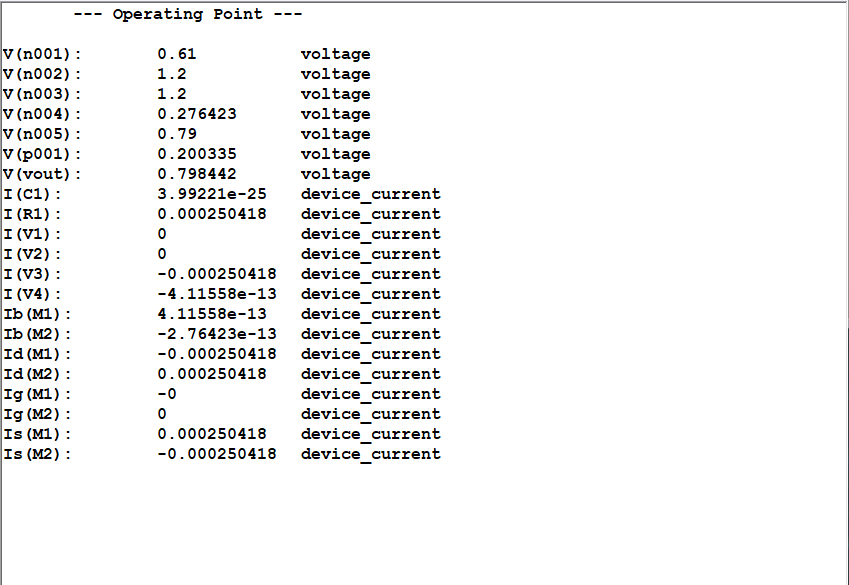
</p>

<p align="center">
<b>Fig 2: DC Operating Point</b>
</p>

---

# TRANSIENT ANALYSIS

Transient analysis studies the circuit response to time-varying input signals.

<p align="center">
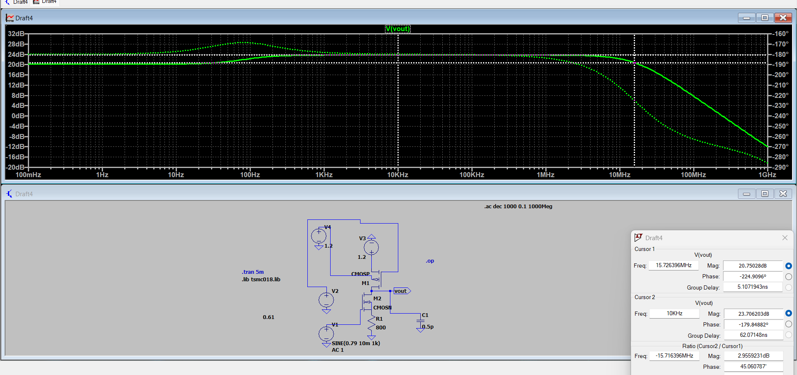
</p>

<p align="center">
<b>Fig 3: Transient Output Response</b>
</p>

---

### Output Peak-to-Peak Voltage

Maximum output voltage

$$
V_{max} = 930.23\,mV
$$

Minimum output voltage

$$
V_{min} = 634.74\,mV
$$

$$
V_{out(pp)} = V_{max} - V_{min}
$$

$$
V_{out(pp)} = 295.49\,mV
$$

---

### Input Signal

$$
V_{in(pp)} = 20mV
$$

---

# Voltage Gain Calculation

$$
A_v = \frac{V_{out(pp)}}{V_{in(pp)}}
$$

$$
A_v = \frac{295.49}{20}
$$

$$
A_v \approx 14.77\,V/V
$$

---

# Gain in Decibels

$$
Gain(dB) = 20\log_{10}(A_v)
$$

$$
Gain \approx 23.38\,dB
$$

---

# AC ANALYSIS – GAIN AND BANDWIDTH

AC analysis determines the **frequency response of the amplifier**.

<p align="center">
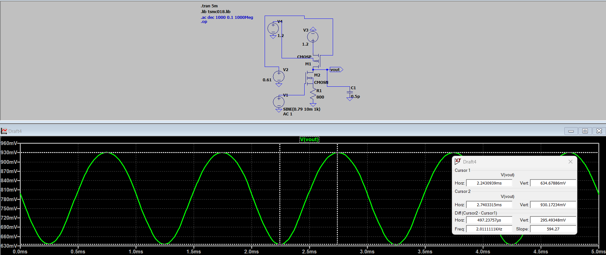
</p>

<p align="center">
<b>Fig 4: AC Frequency Response</b>
</p>

---

## Midband Gain

From the flat region of the Bode plot:

$$
Gain \approx 23.7\,dB
$$

Convert to linear scale:

$$
A_v = 10^{\frac{23.7}{20}}
$$

$$
A_v \approx 15.34\,V/V
$$

---

## Bandwidth

The −3 dB bandwidth occurs at approximately:

$$
BW \approx 15\,MHz
$$

<p align="center">
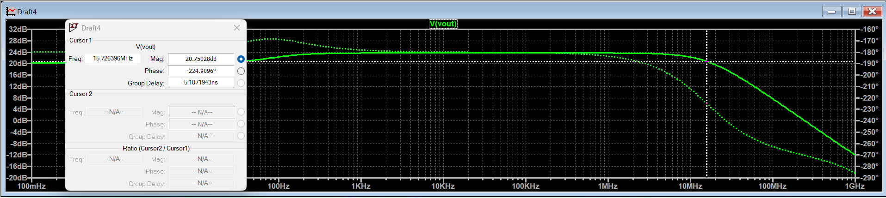
</p>

<p align="center">
<b>Fig 5: −3 dB Bandwidth</b>
</p>

---

## Unity Gain Bandwidth

$$
UGB = A_v \times BW
$$

$$
UGB = 15.34 \times 15\,MHz
$$

$$
UGB \approx 230\,MHz
$$

From the AC plot the unity gain frequency observed is approximately:

$$
UGB \approx 244\,MHz
$$

<p align="center">
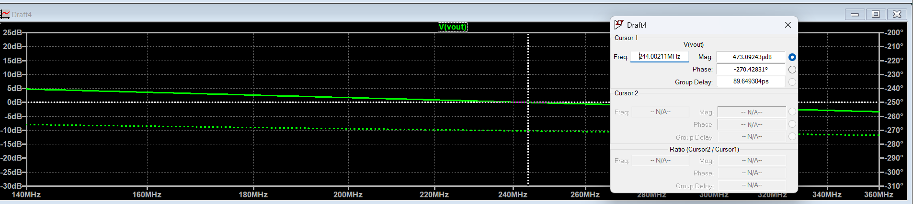
</p>

<p align="center">
<b>Fig 6: Unity Gain Bandwidth</b>
</p>

---

# RESULT

The CMOS amplifier using **NMOS transistor with PMOS active load** was successfully designed and simulated using **TSMC 180 nm technology**.

The **DC operating point** confirmed:

- **Drain current ≈ 250 µA**
- **Output voltage ≈ 0.8 V**

Transient analysis showed amplified output with **295 mV peak-to-peak output voltage**, resulting in a voltage gain of **14.77 V/V (23.38 dB)**.

AC analysis showed a **midband gain of 23.7 dB**, **bandwidth of 15 MHz**, and **unity gain bandwidth ≈ 230 MHz**.

---

# INFERENCE

The experiment successfully demonstrated the design and analysis of a **CMOS amplifier using NMOS as the amplifying device and PMOS as the active load**.

DC analysis confirmed saturation region operation. Transient analysis verified signal amplification, while AC analysis validated the expected gain and bandwidth characteristics.

The close agreement between theoretical and simulated values confirms the effectiveness of CMOS amplifier design using **LTspice and TSMC 180 nm technology**.

#

# EXPERIMENT 02 CIRCUIT 02

# AIM

Design and analyze a **CMOS amplifier with PMOS active load and NMOS current source biasing** using **TSMC 180 nm CMOS technology** and characterize the circuit performance using:

- **DC Operating Point Analysis**
- **Transient Analysis**
- **AC Small Signal Analysis**

Specifications:

| Parameter | Value |
|----------|------|
| Supply Voltage | **VDD = 1.2 V** |
| Drain Current | **ID = 250 µA** |
| Load Capacitance | **CL = 0.5 pF** |
| Channel Length | **L = 360 nm** |

Simulation tool used: **LTspice**

---

# COMPONENTS REQUIRED

1. PMOS transistor (TSMC 180nm model)  
2. NMOS transistor (TSMC 180nm model)  
3. DC voltage sources  
4. Signal voltage source  
5. Capacitor CL  

---

# THEORY

MOSFETs form the fundamental building blocks of modern integrated circuits. CMOS technology combines **NMOS and PMOS devices** to achieve high performance with low power consumption.

In this circuit:

- **M1 (PMOS)** acts as an **active load**
- **M3 (NMOS)** acts as the **amplifying transistor**
- **M4 (NMOS)** acts as a **current source**

This configuration provides:

- High output resistance  
- Stable biasing  
- High input impedance  

However, because of **source degeneration caused by the current source transistor**, the voltage gain may reduce compared to a simple common source amplifier.

---

# SATURATION CONDITIONS

### NMOS Saturation

$$
V_{GS} > V_T
$$

$$
V_{DS} \ge V_{OV}
$$

where

$$
V_{OV} = V_{GS} - V_T
$$

---

### PMOS Saturation

$$
V_{SG} > |V_T|
$$

$$
V_{SD} \ge V_{OV}
$$

where

$$
V_{OV} = V_{SG} - |V_T|
$$

---

# PROCEDURE

### 1. Include Technology Model

The TSMC 180 nm model library was included using:

```
.lib tsmc018.lib
```

---

### 2. Build CMOS Amplifier Circuit

The circuit consists of:

- PMOS transistor connected to **VDD**
- NMOS transistor acting as **gain stage**
- NMOS transistor acting as **current source**
- Output taken from the **drain node**
- Load capacitor connected at the output

---

# DESIGN CALCULATIONS

## 1. Output Voltage Selection

The output voltage is chosen as:

$$
V_{out} = \frac{V_{DD}}{2} + V_{OS}
$$

Given:

$$
V_{OV} = 0.25V
$$

Taking:

$$
V_{OS} = 0.3V
$$

Therefore:

$$
V_{out} = 0.6 + 0.3 = 0.9V
$$

---

## 2. Drain Current Selection

Design current:

**ID = 250 µA**

---

## 3. Bias Voltage for PMOS

$$
V_{SG} = V_{OV} + |V_{TP}|
$$

$$
V_{SG} = 0.25 + 0.39
$$

$$
V_{SG} = 0.64V
$$

Since

$$
V_{SG} = V_S - V_G
$$

$$
0.64 = 1.2 - V_G
$$

$$
V_G = 0.56V
$$

Therefore

**VB1 = 0.56 V**

---

## 4. Bias Voltage for NMOS Current Source

$$
V_{OV} = V_{GS} - V_T
$$

$$
0.25 = V_{GS} - 0.36
$$

$$
V_{GS} = 0.61V
$$

$$
V_{B2} = V_{GS} + V_{OS}
$$

$$
V_{B2} = 0.61 + 0.3
$$

$$
V_{B2} = 0.91V
$$

---

# DEVICE DIMENSIONS

### Initial Calculated Widths

| Parameter | Value |
|----------|------|
| Wn | **12.5 µm** |
| Wp | **29.57 µm** |
| L | **360 nm** |

---

### Final Width After Adjustment

| Parameter | Value |
|----------|------|
| Wn | **31.5 µm** |
| Wp | **74.8 µm** |
| L | **360 nm** |

---


<p align="center">
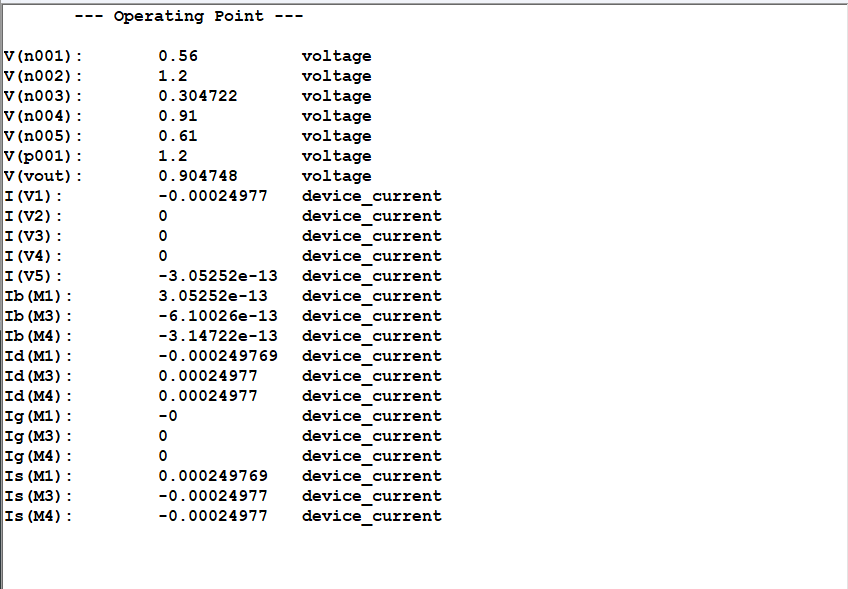
</p>

<p align="center">
<b>Fig A:Q-POINT </b>
</p>


# CIRCUIT

<p align="center">
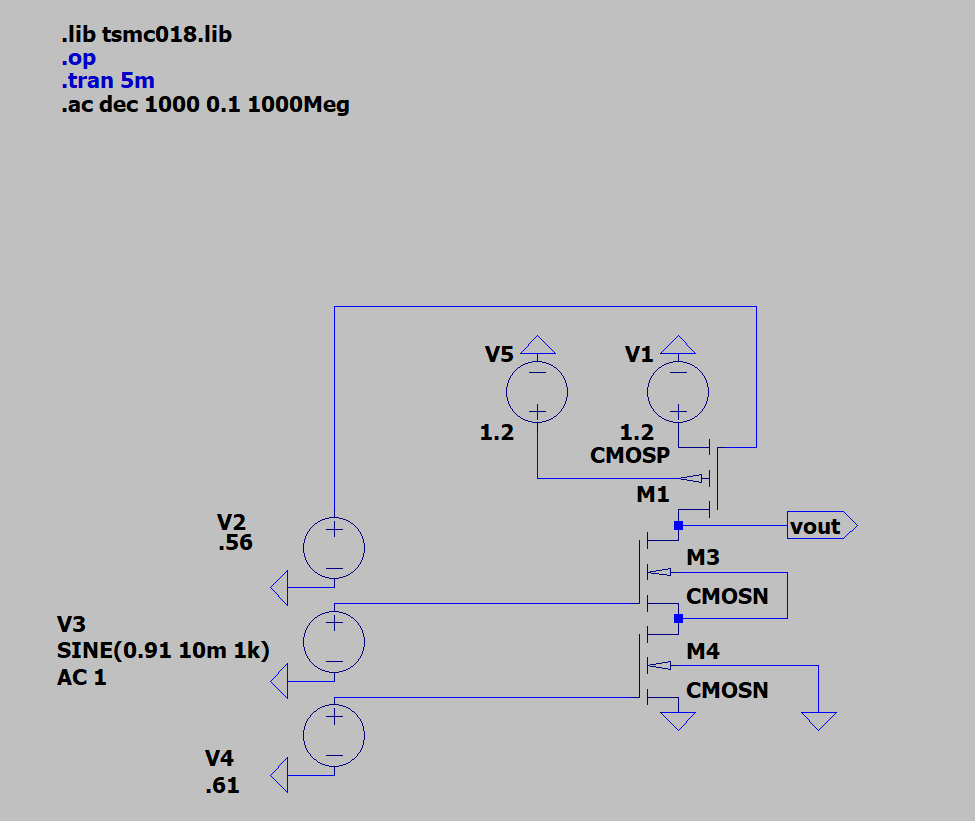
</p>

<p align="center">
<b>Fig 1: CMOS Amplifier Circuit</b>
</p>

---

# DC ANALYSIS

DC analysis determines the **operating point (Q-point)** of the MOSFET amplifier.

---

# Q-POINT VERIFICATION

### Using Calculated Width

Simulation produced:

**Drain Current**

ID ≈ **99.7 µA**

**Output Voltage**

Vout ≈ **0.8758 V**

The difference from theoretical values occurs due to:

- Short channel effects  
- Mobility degradation  
- Channel length modulation  
- Non-ideal BSIM transistor model

---

### After Width Adjustment

Final simulation results:

| Parameter | Value |
|----------|------|
| Drain Current | **ID ≈ 249.77 µA** |
| Output Voltage | **Vout ≈ 0.9047 V** |

These values closely match the design targets.

---

# TRANSIENT ANALYSIS

Transient analysis observes circuit response for time-varying input signals.

<p align="center">
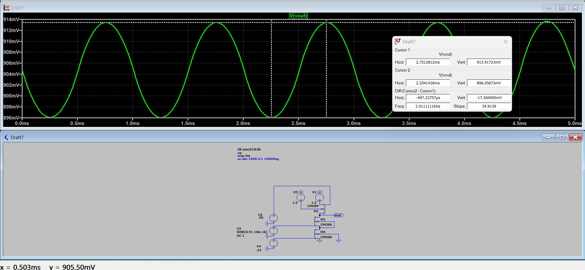
</p>

<p align="center">
<b>Fig 2: Transient Response</b>
</p>

---

### Output Peak-to-Peak Voltage

Maximum output voltage:

**Vmax = 913.417 mV**

Minimum output voltage:

**Vmin = 896.056 mV**

$$
V_{out(pp)} = V_{max} - V_{min}
$$

$$
V_{out(pp)} = 913.417 - 896.056
$$

$$
V_{out(pp)} = 17.36mV
$$

---

### Input Signal

**Vin(pp) = 19.11 mV**

---

# Theoretical Gain


---

# Simulation Gain

$$
A_v = \frac{V_{out(pp)}}{V_{in(pp)}}
$$

$$
A_v = \frac{17.36}{19.11}
$$

$$
A_v ≈ 0.908 \; V/V
$$

---

### Gain in Decibels

$$
Gain(dB) = 20\log_{10}(A_v)
$$

$$
Gain ≈ -0.83 dB
$$

The gain is slightly less than unity because of **source degeneration introduced by the current source transistor.**

---

# AC ANALYSIS – GAIN AND BANDWIDTH

AC analysis determines the **frequency response of the amplifier.**

<p align="center">
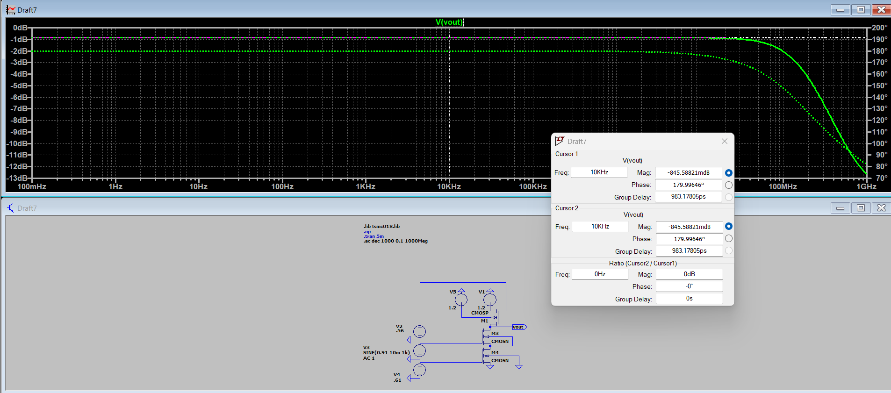
</p>

<p align="center">
<b>Fig 3: AC Frequency Response</b>
</p>

---

## Midband Gain

From the flat region of the Bode plot:

**Gain ≈ −0.845 dB**

Convert to linear scale:

$$
A_v = 10^{\frac{-0.845}{20}}
$$

$$
A_v ≈ 0.908 \; V/V
$$

---

## −3 dB Bandwidth

From the AC plot:

**BW ≈ 104.75 MHz**

This corresponds to the frequency where the gain falls **3 dB below the midband gain.**

---

## Unity Gain Frequency

In this circuit the **unity gain (0 dB) frequency is not observed.**

Reason:

- Midband gain is **less than 1 (negative dB)**  
- Therefore the gain **never crosses 0 dB**  
- The circuit behaves more like a **source-degenerated amplifier stage**

---

# RESULT

The CMOS amplifier with PMOS active load and NMOS current source biasing was successfully designed and simulated using **TSMC 180 nm technology**.

The **DC operating point** showed:

- **Drain current ≈ 249.77 µA**
- **Output voltage ≈ 0.9047 V**

Transient analysis produced a gain of approximately:

**0.908 V/V**

AC analysis showed:

- **Midband gain ≈ −0.845 dB**
- **Bandwidth ≈ 104.75 MHz**

---

# INFERENCE

The CMOS amplifier was successfully designed and analyzed using LTspice.

DC analysis confirmed correct biasing in the saturation region. Transient analysis verified signal amplification, while AC analysis revealed wide bandwidth but slightly reduced gain due to source degeneration.

Differences between theoretical and simulated values arise from **non-ideal transistor effects such as channel length modulation, parasitic capacitances, and mobility degradation in the TSMC 180 nm model.**

# EXPERIMENT 02 CIRCUIT 03

# AIM

Design and analyze a **CMOS amplifier using NMOS transistor with current source configuration** using **TSMC 180 nm CMOS technology** and characterize the circuit performance under the following specifications:

| Parameter | Value |
|----------|------|
| Supply Voltage | **VDD = 1.2 V** |
| Drain Current | **ID = 250 µA** |
| Load Capacitance | **CL = 0.5 pF** |
| Channel Length | **L = 360 nm** |

The circuit performance is verified using:

- **DC Operating Point Analysis**
- **Transient Analysis**
- **AC Small Signal Analysis**

Simulation tool used: **LTspice**

---

# COMPONENTS REQUIRED

1. PMOS transistor (TSMC 180nm model)  
2. NMOS transistor (TSMC 180nm model)  
3. DC voltage sources  
4. Signal voltage source  
5. Capacitor CL  

---

# THEORY

CMOS amplifiers are widely used in analog integrated circuits due to their **high gain, low power consumption, and high input impedance**.

In this experiment, a **three-transistor CMOS amplifier configuration** is implemented where:

- **M1 (PMOS)** acts as an active load
- **M2 (NMOS)** acts as the amplifying transistor
- **M3 (NMOS)** acts as the current source

The current source transistor ensures **constant bias current**, improving gain stability and reducing distortion.

For proper amplifier operation, MOSFETs must operate in the **saturation region**.

---

# SATURATION CONDITIONS

## NMOS Saturation Condition

$$
V_{GS} > V_T
$$

$$
V_{DS} \ge V_{OV}
$$

Where

$$
V_{OV} = V_{GS} - V_T
$$

---

## PMOS Saturation Condition

$$
V_{SG} > |V_T|
$$

$$
V_{SD} \ge V_{OV}
$$

Where

$$
V_{OV} = V_{SG} - |V_T|
$$

---

# PROCEDURE

### 1. Include Technology Model

The TSMC 180 nm model library was included in LTspice using:

```
.lib tsmc018.lib
```

---

### 2. Build the CMOS Amplifier Circuit

The circuit consists of:

- PMOS transistor connected to **VDD**
- NMOS amplifier transistor
- NMOS current source transistor
- Output taken at the **drain of M2**
- Bias voltages applied to **VB1 and VB2**
- Load capacitor connected at the output

---

### 3. Initial Device Parameters

The channel length was fixed as:

```
L = 360 nm
```

Initial width values were calculated theoretically.

---

### 4. DC Operating Point Analysis

The **.op command** was executed in LTspice to determine:

- Drain current  
- Output voltage  
- Node voltages  

---

### 5. Bias Adjustment

Transistor widths were adjusted until the required operating point was achieved:

```
ID ≈ 250 µA
Vout ≈ 0.9 V
```

---

### 6. Transient Analysis

A sinusoidal signal was applied to the input and **.tran analysis** was performed to observe time-domain amplification.

---

### 7. AC Small Signal Analysis

AC magnitude was set to **1 V**, and **.ac analysis** was performed to obtain:

- Midband gain  
- Frequency response  
- Bandwidth  

---

# DESIGN CALCULATIONS

## 1. Drain Current Selection

```
ID = 250 µA
```

---

## 2. Output Voltage Selection

```
Vout = VDD/2 + VDS
Vout = 0.6 + 0.3
Vout = 0.9 V
```

---

## 3. Overdrive Voltage

```
VOV = 0.25 V
VT ≈ 0.36 V
```

```
VGS = VOV + VT
VGS = 0.25 + 0.36
VGS = 0.61 V
```

---

## 4. Bias Voltages

```
VB1 ≈ 0.56 V
VB2 = VGS + VDS
VB2 = 0.61 + 0.3
VB2 = 0.91 V
```

---

## 5. Device Dimensions

Initial calculated widths:

| Parameter | Value |
|----------|------|
| NMOS Width | **Wn ≈ 12.49 µm** |
| PMOS Width | **Wp ≈ 29.57 µm** |
| Channel Length | **L = 360 nm** |

Final adjusted widths:

| Parameter | Value |
|----------|------|
| NMOS Width | **Wn = 507 µm** |
| PMOS Width | **Wp = 75.5 µm** |

---

# CIRCUIT

<p align="center">
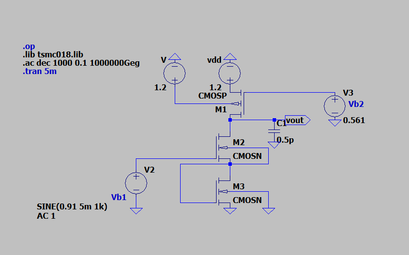
</p>

<p align="center">
<b>Fig 1: CMOS Amplifier Circuit</b>
</p>

---

# DC ANALYSIS

DC analysis determines the **operating point (Q-point)** of the MOSFET amplifier.

## Initial Operating Point

| Parameter | Value |
|----------|------|
| Output Voltage | **Vout ≈ 1.19 V** |
| Drain Current | **ID ≈ 6.5 µA** |


---

## Final Operating Point

| Parameter | Value |
|----------|------|
| Drain Current | **ID ≈ 249 µA** |
| Output Voltage | **Vout ≈ 0.91 V** |

<p align="center">
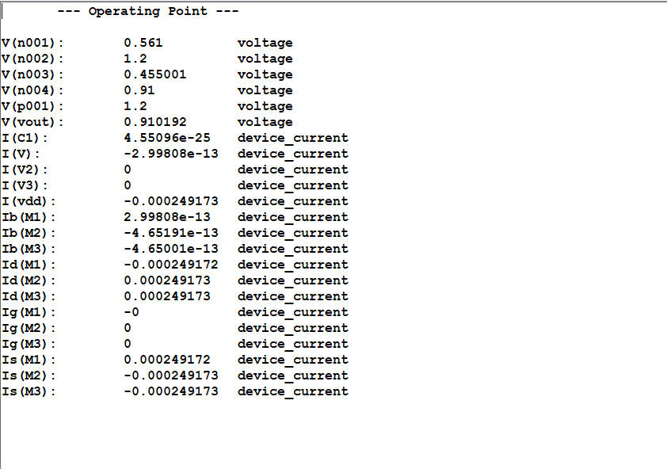
</p>

---

# TRANSIENT ANALYSIS

<p align="center">
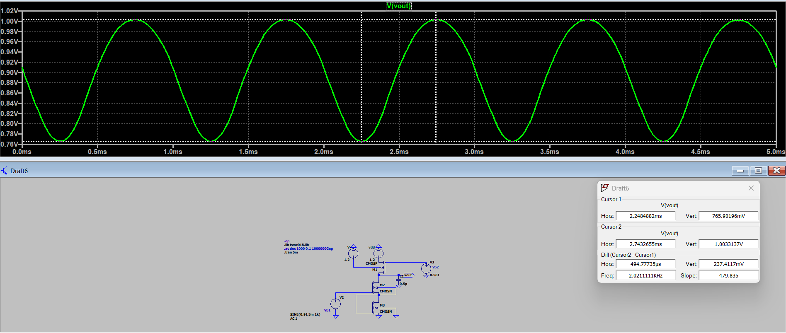
</p>

```
Vin = 9.94 mV
Vmax = 1.003 V
Vmin = 0.765 V
```

```
Vout(pp) = Vmax − Vmin
Vout(pp) = 237 mV
```

---

# THEORETICAL GAIN

(To be calculated using small signal model if required)

---

# SIMULATED VOLTAGE GAIN

```
Av = Vout(pp) / Vin(pp)
Av = 237 / 9.94
Av ≈ 23.8 V/V
```

---

# GAIN IN DECIBELS

```
Gain(dB) = 20 log10(Av)
Gain ≈ 27.77 dB
```

---

# AC ANALYSIS – GAIN AND BANDWIDTH

<p align="center">
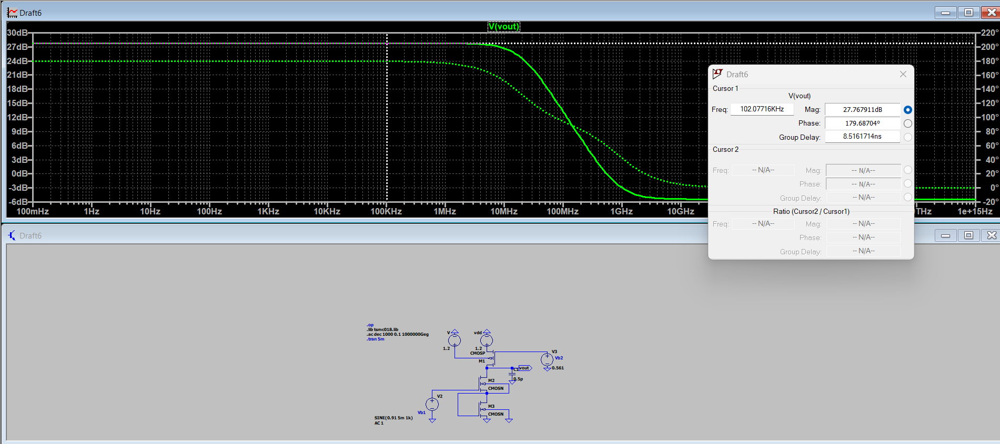
</p>

## Midband Gain

```
Gain ≈ 27.77 dB
```

```
Av = 10^(27.77/20)
Av ≈ 24.47 V/V
```

---

## Bandwidth

```
BW ≈ 19.3 MHz
```

<p align="center">
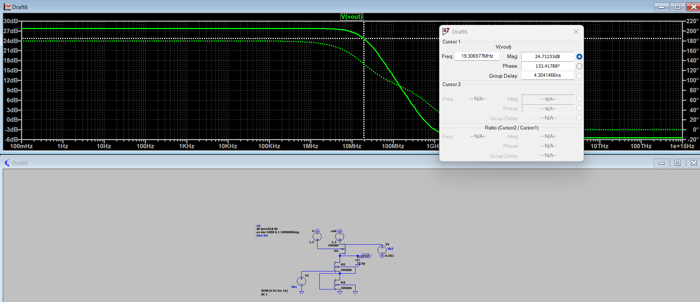
</p>

---

## Unity Gain Bandwidth

```
UGB = Av × BW
UGB = 24.47 × 19.3 MHz
UGB ≈ 472 MHz
```

From AC plot:

```
UGB ≈ 553 MHz
```

<p align="center">
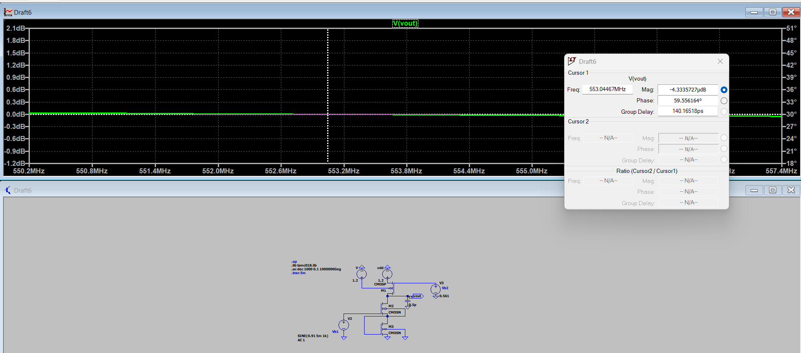
</p>

---

# RESULT

The CMOS amplifier using **NMOS transistor with PMOS active load and NMOS current source biasing** was successfully designed and simulated using **TSMC 180 nm technology**.

The **DC operating point** confirmed:

- **Drain current ≈ 250 µA**
- **Output voltage ≈ 0.9 V**

Transient analysis showed amplified output with approximately **237 mV peak-to-peak output voltage**, resulting in a voltage gain of **23.8 V/V (27.77 dB)**.

AC analysis showed a **midband gain of 27.77 dB**, **bandwidth of 19.3 MHz**, and **unity gain bandwidth ≈ 472 MHz**.

---

# INFERENCE

The experiment demonstrated the design and analysis of a **CMOS amplifier with current source biasing**.  

DC analysis verified correct biasing and saturation operation of MOSFETs. Transient analysis confirmed signal amplification, while AC analysis revealed the gain and bandwidth characteristics of the amplifier.

The close agreement between theoretical and simulated values confirms the effectiveness of CMOS amplifier design using **LTspice and TSMC 180 nm technology**.
