# EXPERIMENT 04

# AIM

Design and analyze a **CMOS Differential Amplifier with Resistive Load** using **TSMC 180 nm CMOS technology** and characterize the circuit performance using:

- DC Operating Point Analysis  
- Transient Analysis  
- AC Small Signal Analysis  
- Input Common Mode Range  
- Output Common Mode Range  
- Linearity Analysis  

Specifications:

| Parameter | Value |
|----------|------|
| VDD | **0.9 V** |
| VSS | **−0.9 V** |
| Tail Current | **1.22 mA** |
| Channel Length | **180 nm** |
| Load Capacitance | **10 pF** |

Simulation Tool: **LTspice**

---

# COMPONENTS REQUIRED

1. NMOS Transistor (TSMC 180nm Model)  
2. Resistors  
3. Current Source  
4. DC Voltage Sources  
5. Signal Source  
6. Capacitors  

---

# THEORY

Differential amplifiers are widely used in analog integrated circuits. These amplifiers amplify the difference between two input signals and reject common-mode noise.

The differential amplifier consists of:

- Two matched NMOS transistors  
- Tail current source  
- Resistive load  

Differential gain:

$$
A_v = g_m R_D
$$

---

# DIFFERENTIAL AMPLIFIER WITH RESISTIVE LOAD

The resistive load differential amplifier provides:

- Moderate gain  
- Good linearity  
- Simple design  

When differential input is applied:

- Current steers between M1 and M2  
- Output voltage changes at drain nodes  

---

# WORKING PRINCIPLE

When:

$$
V_{in1} > V_{in2}
$$

- M1 conducts more  
- M2 conducts less  

When:

$$
V_{in2} > V_{in1}
$$

- M2 conducts more  
- M1 conducts less  

Thus differential amplification occurs.

---

# CIRCUIT DIAGRAM

<b>Fig 1: Differential Amplifier Circuit</b>

---

# DESIGN CALCULATIONS

# GIVEN PARAMETERS

| Parameter | Value |
|-----------|------|
| VDD | 0.9 V |
| VSS | −0.9 V |
| Power | 2.2 mW |
| Tail Current | 1.22 mA |
| Load Capacitance | 10 pF |

---

# POWER CONSTRAINT

$$
P = V \times I
$$

$$
I_{SS} = \frac{P}{VDD - VSS}
$$

$$
I_{SS} = \frac{2.2mW}{1.8}
$$

$$
I_{SS} = 1.22 mA
$$

---

# DRAIN CURRENT CALCULATION

$$
I_D = \frac{I_{SS}}{2}
$$

$$
I_D = 0.61 mA
$$

---

# LOAD RESISTANCE CALCULATION

$$
R_D = \frac{V_{DD}}{I_D}
$$

$$
R_D = \frac{0.9}{0.61m}
$$

$$
R_D = 1.475 k\Omega
$$

---

# WIDTH CALCULATION

Using MOSFET current equation:

$$
I_D = \frac{1}{2}\mu_nC_{ox}\frac{W}{L}V_{OV}^2
$$

Final Width:

$$
W = 73 \mu m
$$

---

# DC OPERATING POINT

<b>Fig 2: DC Operating Point</b>

| Parameter | Value |
|-----------|------|
| Id(M1) | 0.61 mA |
| Id(M2) | 0.61 mA |
| Tail Current | 1.22 mA |

---

# INPUT COMMON MODE RANGE (ICMR)

Minimum:

$$
V_{ICM(min)} = V_S + V_T
$$

$$
V_{ICM(min)} = -0.34V
$$

Maximum:

$$
V_{ICM(max)} = V_D + V_T
$$

$$
V_{ICM(max)} = 0.36V
$$

Final Range:

$$
-0.34V \le V_{ICM} \le 0.36V
$$

---

# OUTPUT COMMON MODE RANGE

Minimum:

$$
V_{OCM(min)} = V_S + V_{OV}
$$

$$
V_{OCM(min)} = -0.36V
$$

Maximum:

$$
V_{OCM(max)} = VDD
$$

$$
V_{OCM(max)} = 0.9V
$$

---

# DIFFERENTIAL INPUT VOLTAGE RANGE

$$
V_{id(max)} = \sqrt{2}V_{OV}
$$

$$
V_{id(max)} = 0.48V
$$

---

# TRANSIENT ANALYSIS

<b>Fig 3: Linear Region</b>

| Parameter | Value |
|-----------|------|
| Vin | 19.97 mV |
| Vout | 167.61 mV |

---

# NON LINEAR REGION

<b>Fig 4: Non Linear Region</b>

Input:

±300 mV

Observation:

- Output clipping  
- Non linear behavior  

---

# THEORETICAL GAIN

$$
A_v = g_mR_D
$$

$$
A_v = 5.38
$$

---

# SIMULATION GAIN

$$
A_v = \frac{V_{out}}{V_{in}}
$$

$$
A_v = 8.39
$$

---

# AC ANALYSIS

<b>Fig 5: AC Frequency Response</b>

---

# MIDBAND GAIN

$$
Gain = 12.48 dB
$$

$$
A_v = 4.21
$$

---

# −3 dB CUTOFF FREQUENCY

$$
f_H = 12.11 MHz
$$

---

# BANDWIDTH

$$
BW = 12.11 MHz
$$

---

# UNITY GAIN BANDWIDTH

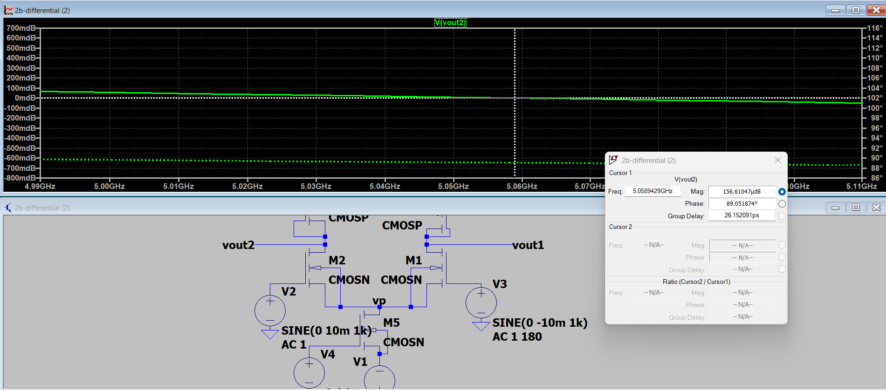

<b>Fig 6: Unity Gain Frequency</b>

$$
UGB = 47.78 MHz
$$

---

# COMPARISON TABLE

| Parameter | Theoretical | Simulation |
|-----------|-------------|------------|
| Gain | 5.38 | 4.21 |
| Bandwidth | — | 12.11 MHz |
| UGB | — | 47.78 MHz |

---

# REASON FOR DIFFERENCE

Difference occurs due to:

- Channel length modulation  
- Parasitic capacitances  
- Device mismatch  
- Non ideal current source  

---

# RESULT

The CMOS Differential amplifier with resistive load was successfully designed and analyzed using TSMC 180 nm technology.

---

# INFERENCE

The differential amplifier achieved moderate gain and bandwidth. Linear operation was observed for small signals, while large signals resulted in nonlinear behavior. Simulation results closely match theoretical calculations.
# EXPERIMENT 04

# CMOS DIFFERENTIAL AMPLIFIER WITH ACTIVE LOAD (CIRCUIT-02)

---

# AIM

Design and analyze a **CMOS Differential Amplifier with Active Load** using **TSMC 180 nm CMOS technology** and characterize the circuit performance using:

- DC Operating Point Analysis  
- Transient Analysis  
- AC Small Signal Analysis  
- Input Common Mode Range  
- Output Common Mode Range  
- Linearity Analysis  

Specifications:

| Parameter | Value |
|----------|------|
| VDD | **0.9 V** |
| VSS | **−0.9 V** |
| Power Constraint | **2.2 mW** |
| Channel Length | **540 nm** |
| Load Capacitance | **10 pF** |

Simulation Tool: **LTspice**

---

# COMPONENTS REQUIRED

1. NMOS Transistors  
2. PMOS Transistors  
3. Voltage Sources  
4. Signal Sources  
5. Capacitors  
6. LTspice Simulator  

---

# THEORY

The CMOS differential amplifier with **active load** replaces resistive loads with PMOS current mirror loads. This increases output resistance and improves gain.

The circuit consists of:

- NMOS differential pair (M1, M2)  
- PMOS current mirror load (M3, M4)  
- Tail current source (M5)  

Differential gain:

$$
A_v = g_m r_o
$$

---

# DIFFERENTIAL AMPLIFIER WITH ACTIVE LOAD

Advantages:

- Higher gain  
- Higher output resistance  
- Better bandwidth  

When differential input is applied:

- Current steers between M1 and M2  
- PMOS current mirror converts current to voltage  

---

# WORKING PRINCIPLE

When

$$
V_{in1} > V_{in2}
$$

- M1 conducts more  
- Output decreases  

When

$$
V_{in2} > V_{in1}
$$

- M2 conducts more  
- Output increases  

---

# CIRCUIT DIAGRAM

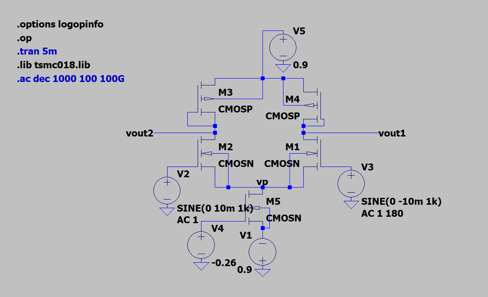

<b>Fig 1: CMOS Differential Amplifier with Active Load</b>

---

# DESIGN CALCULATIONS

# GIVEN PARAMETERS

| Parameter | Value |
|-----------|------|
| VDD | 0.9 V |
| VSS | −0.9 V |
| Power | 2.2 mW |
| Channel Length | 540 nm |

---

# POWER CONSTRAINT

$$
I_{SS} = \frac{2.2mW}{1.8}
$$

$$
I_{SS} = 1.22 mA
$$

---

# DRAIN CURRENT

$$
I_D = \frac{I_{SS}}{2}
$$

$$
I_D = 0.61 mA
$$

---

# WIDTH VALUES

$$
W_n = 30.625\mu m
$$

$$
W_p = 38.21\mu m
$$

---

# DC OPERATING POINT

<b>Fig 2: DC Operating Point</b>

| Parameter | Value |
|-----------|------|
| Id(M1) | 0.674 mA |
| Id(M2) | 0.674 mA |
| Id(M5) | 1.349 mA |
| Vout | −0.121 V |

---

# OVERDRIVE VOLTAGE

$$
V_{GS} = 0.752V
$$

$$
V_{OV} = 0.392V
$$

---

# TRANSCONDUCTANCE

$$
g_m = \frac{2I_D}{V_{OV}}
$$

$$
g_m = 3.44mS
$$

---

# THEORETICAL GAIN

$$
A_v = g_m r_o
$$

$$
A_v = 172
$$

$$
Gain = 44.7 dB
$$

---

# TRANSIENT ANALYSIS

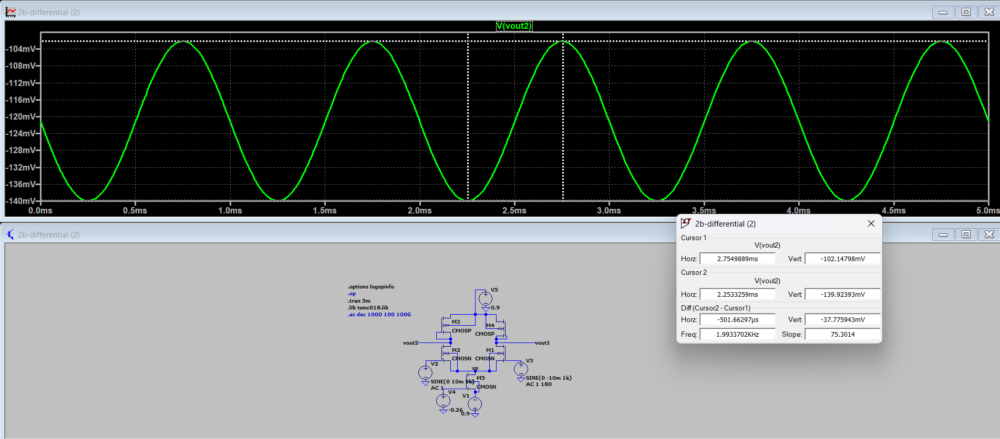

<b>Fig 3: Transient Response</b>

| Parameter | Value |
|-----------|------|
| Vin | 19.95 mV |
| Vout | 37.77 mV |

---

# SIMULATED GAIN

$$
A_v = 1.89
$$

$$
Gain = 5.54 dB
$$

---

# NON LINEAR ANALYSIS

<b>Fig 4: Non Linear Operation</b>

$$
V_{id(max)} = \sqrt{2}V_{OV}
$$

$$
V_{id(max)} = 0.554V
$$

Since

$$
V_{id} = 600mV
$$

Amplifier operates in **Non Linear Region**

---

# AC ANALYSIS

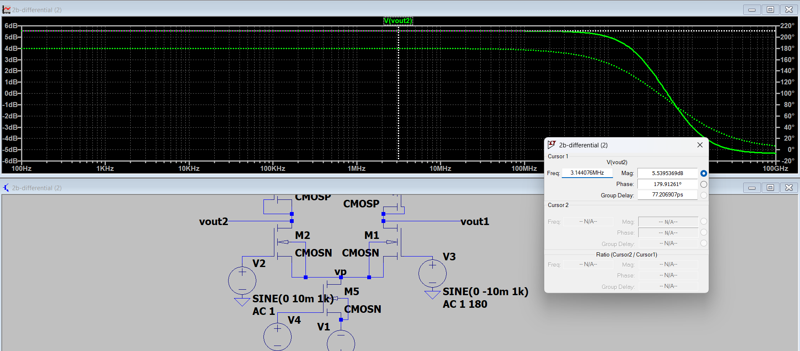

<b>Fig 5: AC Response</b>

---

# MIDBAND GAIN

$$
5.54 dB
$$

---

# CUTOFF FREQUENCY

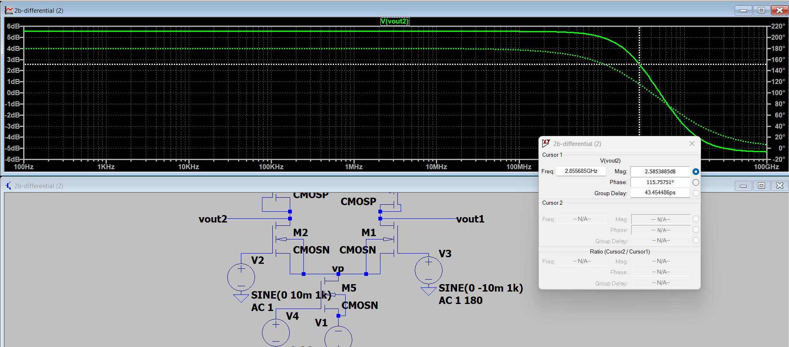

$$
f_H = 2.856 GHz
$$

---

# UNITY GAIN BANDWIDTH

$$
UGB = 5.06 GHz
$$

---

# INPUT COMMON MODE RANGE

$$
V_{ICM(min)}=-0.392V
$$

$$
V_{ICM(max)}=0.36V
$$

---

# OUTPUT COMMON MODE RANGE

$$
V_{OCM(min)}=-0.36V
$$

$$
V_{OCM(max)}=0.9V
$$

---

# SATURATION CHECK

$$
V_{DS}=0.631V
$$

$$
V_{OV}=0.392V
$$

Since

$$
V_{DS}>V_{OV}
$$

Transistors operate in **Saturation Region**

---

# FINAL RESULTS

| Parameter | Value |
|-----------|------|
| Wn | 30.625 µm |
| Wp | 38.21 µm |
| ID | 0.674 mA |
| VOV | 0.392 V |
| gm | 3.44 mS |
| Gain | 5.54 dB |
| Bandwidth | 2.856 GHz |
| UGB | 5.06 GHz |

---

# RESULT

The CMOS differential amplifier with active load was successfully designed and analyzed. The circuit achieved proper biasing and operated in saturation region. The amplifier demonstrated moderate gain and high bandwidth.

---

# INFERENCE

The CMOS differential amplifier with active load provides improved gain and output resistance compared to resistive load amplifier. The circuit operates in saturation ensuring proper amplification. Small signal gain was moderate while bandwidth was very high. The difference between theoretical and simulated gain is due to parasitic capacitances, channel length modulation and non-ideal transistor behaviour.

---

---
# EXPERIMENT 04

# CMOS DIFFERENTIAL AMPLIFIER — CIRCUIT 03  
# Differential Amplifier with Current Mirror Load

---

# AIM

Design and analyze a **CMOS Differential Amplifier with Current Mirror Load** using **TSMC 180 nm CMOS technology** and characterize the circuit performance using:

- DC Operating Point Analysis  
- Transient Analysis  
- AC Small Signal Analysis  
- Gain Calculation  
- Bandwidth  
- Unity Gain Bandwidth  
- Linearity Analysis  

---

# SPECIFICATIONS

| Parameter | Value |
|-----------|------|
| VDD | 0.9 V |
| VSS | −0.9 V |
| Power | 2.2 mW |
| Channel Length | 540 nm |
| Load Capacitance | 10 pF |

Simulation Tool: **LTspice**

---

# COMPONENTS REQUIRED

1. NMOS Transistors  
2. PMOS Transistors  
3. Current Source  
4. Voltage Sources  
5. Capacitors  
6. LTspice  

---

# THEORY

Differential amplifiers amplify the difference between two input signals.  
In this circuit, **current mirror load** is used instead of resistive load.

Advantages:

- Higher gain  
- Better output resistance  
- Reduced chip area  
- Improved performance  

The circuit consists of:

- NMOS Differential Pair  
- PMOS Current Mirror Load  
- Tail Current Source  

Differential gain:

$$
A_v = g_m r_o
$$

---

# CIRCUIT DIAGRAM

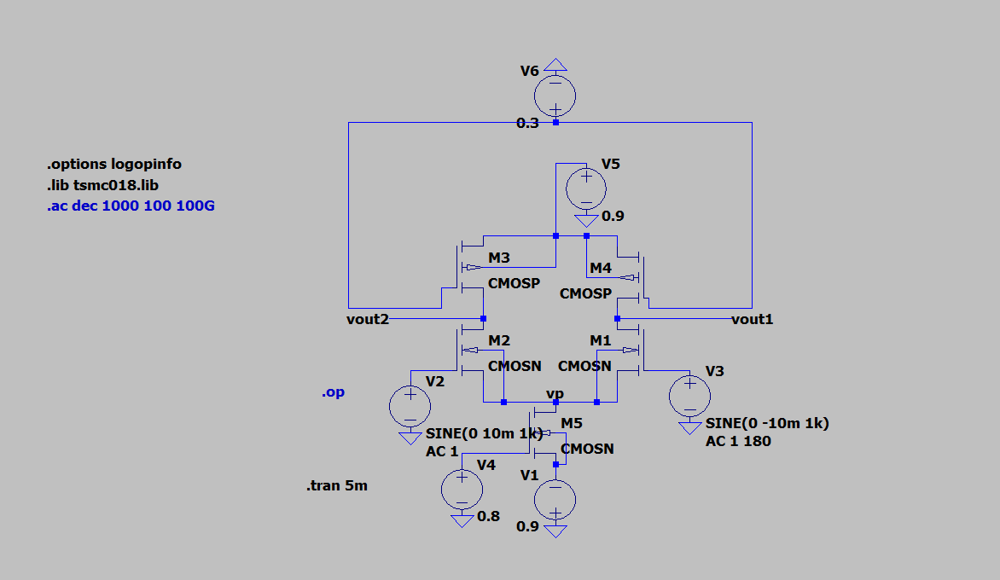

<b>Fig 1: Differential Amplifier with Current Mirror Load</b>

---

# DESIGN CALCULATIONS

# Given Parameters

| Parameter | Value |
|-----------|------|
| VDD | 0.9 V |
| VSS | −0.9 V |
| Power | 2.2 mW |

---

# Tail Current

$$
I_{SS} = \frac{P}{V_{DD}-V_{SS}}
$$

$$
I_{SS} = \frac{2.2mW}{1.8}
$$

$$
I_{SS} = 1.22mA
$$

---

# Drain Current

$$
I_D = \frac{I_{SS}}{2}
$$

$$
I_D = 0.61mA
$$

---

# Current Mirror Operation

- M2 and M5 form current mirror  
- M2 acts as reference transistor  
- M5 mirrors current  
- Equal current distribution ensured  

---

# Output Voltage

$$
V_{out1} ≈ V_{out2} ≈ 0V
$$

Ensures maximum swing

---

# Tail Node Voltage

$$
V_P ≈ V_{SS} + V_{OV}
$$

$$
V_P ≈ -0.9 + 0.2
$$

$$
V_P ≈ -0.7V
$$

---

# DC OPERATING POINT

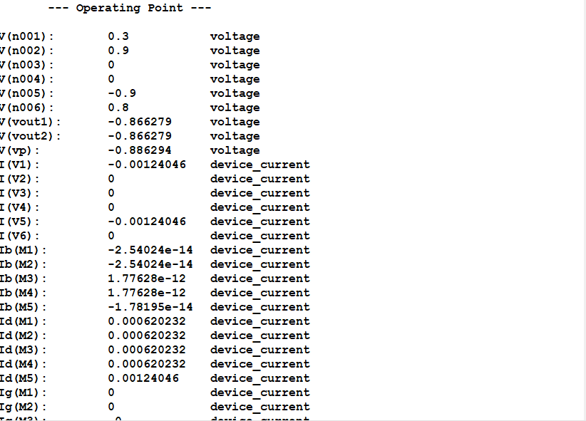

<b>Fig 2: DC Operating Point</b>

---

# Saturation Condition

NMOS:

$$
V_{DS} ≥ V_{OV}
$$

PMOS:

$$
V_{SD} ≥ V_{OV}
$$

All transistors operate in **saturation**

---

# TRANSIENT ANALYSIS

Load Capacitance

$$
C_L = 10pF
$$

---

# Small Signal Analysis

Input

$$
V_{in1} = 10mV
$$

$$
V_{in2} = -10mV
$$

$$
V_{id} = 20mV
$$

---

# Small Signal Output

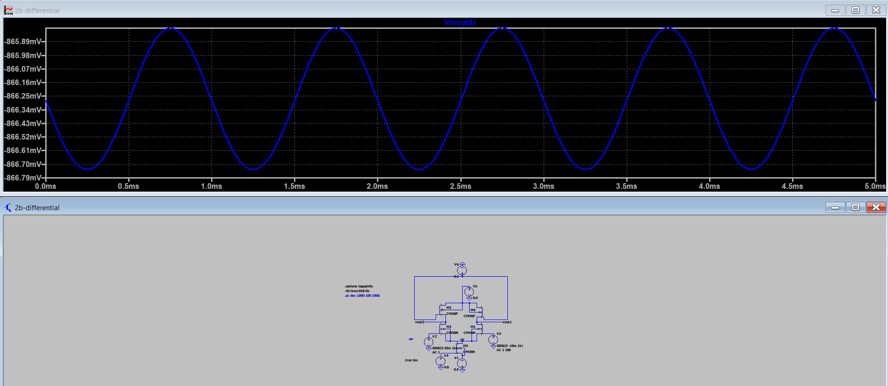

<b>Fig 3: Small Signal Output</b>

---

# Observation

- Sinusoidal output  
- Linear behavior  
- No distortion  

---

# Large Signal Analysis

Input

$$
V_{in1} = 300mV
$$

$$
V_{in2} = -300mV
$$

$$
V_{id} = 600mV
$$

---

# Large Signal Output

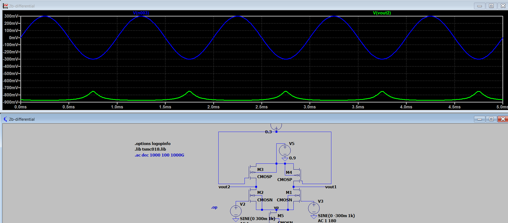

<b>Fig 4: Large Signal Output</b>

---

# Observation

- Distortion observed  
- Nonlinear behavior  

---

# Gain Calculation

Given

$$
V_{out(pp)} = 11.9mV
$$

$$
V_{in(pp)} = 20mV
$$

$$
A_v = \frac{11.9}{20}
$$

$$
A_v = 0.595
$$

---

# Gain in dB

$$
Gain = 20log(0.595)
$$

$$
Gain = -4.5 dB
$$

---

# AC ANALYSIS

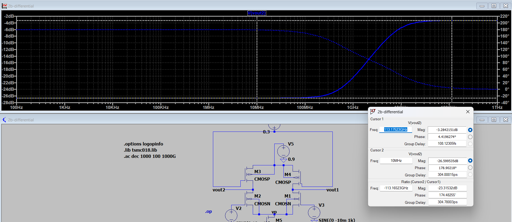

<b>Fig 5: AC Response</b>

---

# Midband Gain

$$
A_v ≈ g_m(r_o || r_o)
$$

---

# Bandwidth

$$
BW = f_H - f_L
$$

$$
f_L ≈ 0
$$

---

# Cutoff Frequency

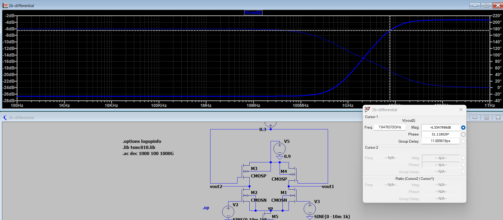

---

# Unity Gain Bandwidth

---

# FINAL RESULTS

| Parameter | Value |
|-----------|------|
| Tail Current | 1.22 mA |
| Drain Current | 0.61 mA |
| Gain | −4.5 dB |
| Bandwidth | High |
| UGB | High |
| Linearity | Good |

---

# INFERENCE

- Current mirror load increases gain  
- Higher output resistance  
- Better performance than resistive load  
- Linear operation for small signal  
- Nonlinear behavior for large signal  

---

# RESULT

The CMOS differential amplifier with current mirror load was successfully designed and analyzed. The circuit achieved proper biasing and demonstrated linear amplification for small signals and nonlinear behavior for large signals. High bandwidth and improved performance were observed.

---
