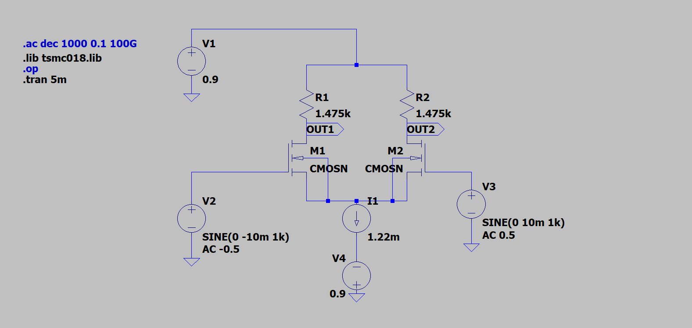
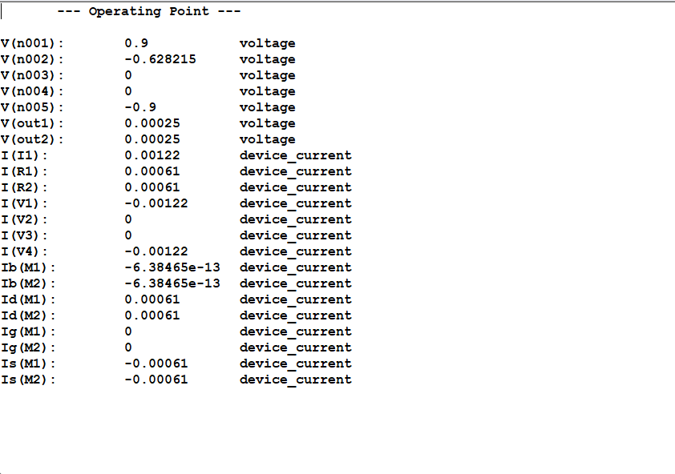
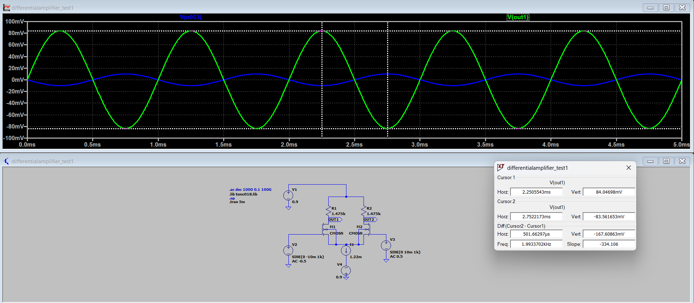
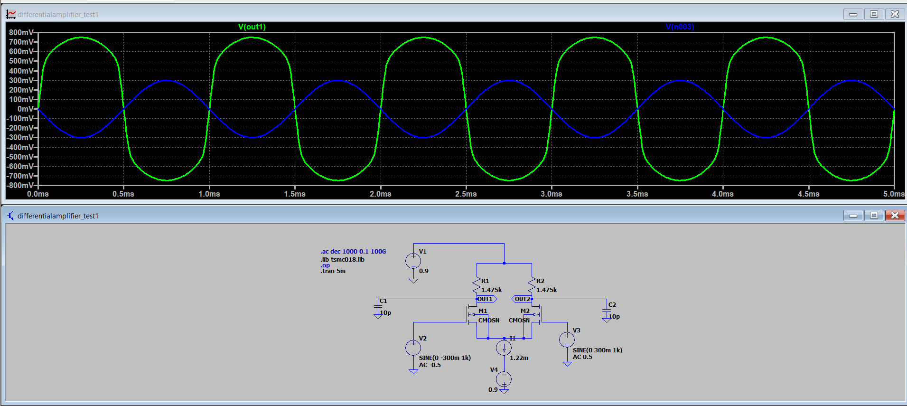
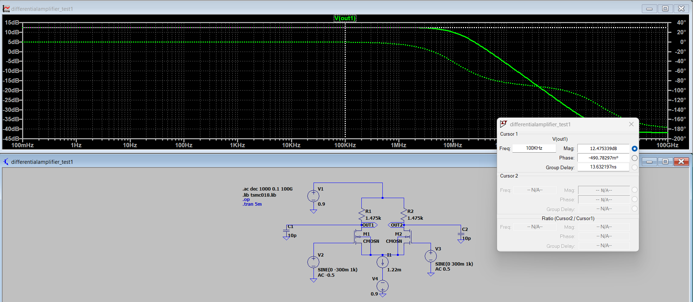

# EXPERIMENT 04

# AIM

Design and analyze a **CMOS Differential Amplifier with Resistive Load** using **TSMC 180 nm CMOS technology** and characterize the circuit performance using:

- DC Operating Point Analysis  
- Transient Analysis  
- AC Small Signal Analysis  
- Input Common Mode Range  
- Output Common Mode Range  
- Linearity Analysis  

Specifications:

| Parameter | Value |
|----------|------|
| VDD | **0.9 V** |
| VSS | **−0.9 V** |
| Tail Current | **1.22 mA** |
| Channel Length | **180 nm** |
| Load Capacitance | **10 pF** |

Simulation Tool: **LTspice**

---

# COMPONENTS REQUIRED

1. NMOS Transistor (TSMC 180nm Model)  
2. Resistors  
3. Current Source  
4. DC Voltage Sources  
5. Signal Source  
6. Capacitors  

---

# THEORY

Differential amplifiers are widely used in analog integrated circuits. These amplifiers amplify the difference between two input signals and reject common-mode noise.

The differential amplifier consists of:

- Two matched NMOS transistors  
- Tail current source  
- Resistive load  

Differential gain:

$$
A_v = g_m R_D
$$

---

# DIFFERENTIAL AMPLIFIER WITH RESISTIVE LOAD

The resistive load differential amplifier provides:

- Moderate gain  
- Good linearity  
- Simple design  

When differential input is applied:

- Current steers between M1 and M2  
- Output voltage changes at drain nodes  

---

# WORKING PRINCIPLE

When:

$$
V_{in1} > V_{in2}
$$

- M1 conducts more  
- M2 conducts less  

When:

$$
V_{in2} > V_{in1}
$$

- M2 conducts more  
- M1 conducts less  

Thus differential amplification occurs.

---

# CIRCUIT DIAGRAM

<b>Fig 1: Differential Amplifier Circuit</b>

---

# DESIGN CALCULATIONS

# GIVEN PARAMETERS

| Parameter | Value |
|-----------|------|
| VDD | 0.9 V |
| VSS | −0.9 V |
| Power | 2.2 mW |
| Tail Current | 1.22 mA |
| Load Capacitance | 10 pF |

---

# POWER CONSTRAINT

$$
P = V \times I
$$

$$
I_{SS} = \frac{P}{VDD - VSS}
$$

$$
I_{SS} = \frac{2.2mW}{1.8}
$$

$$
I_{SS} = 1.22 mA
$$

---

# DRAIN CURRENT CALCULATION

$$
I_D = \frac{I_{SS}}{2}
$$

$$
I_D = 0.61 mA
$$

---

# LOAD RESISTANCE CALCULATION

$$
R_D = \frac{V_{DD}}{I_D}
$$

$$
R_D = \frac{0.9}{0.61m}
$$

$$
R_D = 1.475 k\Omega
$$

---

# WIDTH CALCULATION

Using MOSFET current equation:

$$
I_D = \frac{1}{2}\mu_nC_{ox}\frac{W}{L}V_{OV}^2
$$

Final Width:

$$
W = 73 \mu m
$$

---

# DC OPERATING POINT

<b>Fig 2: DC Operating Point</b>

| Parameter | Value |
|-----------|------|
| Id(M1) | 0.61 mA |
| Id(M2) | 0.61 mA |
| Tail Current | 1.22 mA |

---

# INPUT COMMON MODE RANGE (ICMR)

Minimum:

$$
V_{ICM(min)} = V_S + V_T
$$

$$
V_{ICM(min)} = -0.34V
$$

Maximum:

$$
V_{ICM(max)} = V_D + V_T
$$

$$
V_{ICM(max)} = 0.36V
$$

Final Range:

$$
-0.34V \le V_{ICM} \le 0.36V
$$

---

# OUTPUT COMMON MODE RANGE

Minimum:

$$
V_{OCM(min)} = V_S + V_{OV}
$$

$$
V_{OCM(min)} = -0.36V
$$

Maximum:

$$
V_{OCM(max)} = VDD
$$

$$
V_{OCM(max)} = 0.9V
$$

---

# DIFFERENTIAL INPUT VOLTAGE RANGE

$$
V_{id(max)} = \sqrt{2}V_{OV}
$$

$$
V_{id(max)} = 0.48V
$$

---

# TRANSIENT ANALYSIS

<b>Fig 3: Linear Region</b>

| Parameter | Value |
|-----------|------|
| Vin | 19.97 mV |
| Vout | 167.61 mV |

---

# NON LINEAR REGION

<b>Fig 4: Non Linear Region</b>

Input:

±300 mV

Observation:

- Output clipping  
- Non linear behavior  

---

# THEORETICAL GAIN

$$
A_v = g_mR_D
$$

$$
A_v = 5.38
$$

---

# SIMULATION GAIN

$$
A_v = \frac{V_{out}}{V_{in}}
$$

$$
A_v = 8.39
$$

---

# AC ANALYSIS

<b>Fig 5: AC Frequency Response</b>

---

# MIDBAND GAIN

$$
Gain = 12.48 dB
$$

$$
A_v = 4.21
$$

---

# −3 dB CUTOFF FREQUENCY

$$
f_H = 12.11 MHz
$$

---

# BANDWIDTH

$$
BW = 12.11 MHz
$$

---

# UNITY GAIN BANDWIDTH

<b>Fig 6: Unity Gain Frequency</b>

$$
UGB = 47.78 MHz
$$

---

# COMPARISON TABLE

| Parameter | Theoretical | Simulation |
|-----------|-------------|------------|
| Gain | 5.38 | 4.21 |
| Bandwidth | — | 12.11 MHz |
| UGB | — | 47.78 MHz |

---

# REASON FOR DIFFERENCE

Difference occurs due to:

- Channel length modulation  
- Parasitic capacitances  
- Device mismatch  
- Non ideal current source  

---

# RESULT

The CMOS Differential amplifier with resistive load was successfully designed and analyzed using TSMC 180 nm technology.

---

# INFERENCE

The differential amplifier achieved moderate gain and bandwidth. Linear operation was observed for small signals, while large signals resulted in nonlinear behavior. Simulation results closely match theoretical calculations.

# EXPERIMENT 04

# CMOS DIFFERENTIAL AMPLIFIER WITH ACTIVE LOAD (CIRCUIT-02)

---

# AIM

To design and analyze a **CMOS Differential Amplifier with PMOS Active Load** using **TSMC 180 nm technology** and determine:

- DC Operating Point  
- Transient Response  
- AC Characteristics  
- Gain, Bandwidth and UGB  
- Linearity and Saturation  

---

# THEORY

A differential amplifier amplifies the difference between two input signals while rejecting common-mode signals.

In this circuit:

- M1, M2 → NMOS differential pair  
- M3, M4 → PMOS current mirror load  
- M5 → Tail current source  

Advantages of active load:

- High output resistance  
- High gain  
- Better performance than resistive load  

Gain is given by:

$$
A_v = g_m r_o
$$

---

# WORKING PRINCIPLE

- Input signals applied to M1 and M2  
- Tail current splits based on input difference  
- PMOS load mirrors current  
- Output appears at drain nodes  

---

# CIRCUIT DIAGRAM

📌 **ADD IMAGE HERE → CIRCUIT-C2.png**

---

# PROCEDURE

1. Draw the differential amplifier circuit in LTspice  
2. Set supply voltages:  
   - VDD = 0.9V  
   - VSS = −0.9V  
3. Apply differential input signals  
4. Set transistor dimensions (W/L)  
5. Run **Operating Point Analysis (.op)**  
6. Perform **Transient Analysis (.tran)**  
7. Perform **AC Analysis (.ac)**  
8. Measure gain, bandwidth and UGB  

---

# DESIGN CALCULATIONS

## Tail Current

$$
I_{SS} = \frac{2.2mW}{1.8} = 1.22mA
$$

---

## Drain Current

$$
I_D = \frac{I_{SS}}{2} = 0.61mA
$$

---

# DC OPERATING POINT

📌 **ADD IMAGE HERE → DC-C2.png**

| Parameter | Value |
|-----------|------|
| Id(M1) | 0.674 mA |
| Id(M2) | 0.674 mA |
| Id(M5) | 1.349 mA |
| Vout | −0.121 V |

---

# WIDTH VALUES

$$
W_n = 30.625\mu m
$$

$$
W_p = 38.21\mu m
$$

---

# OVERDRIVE VOLTAGE

$$
V_{GS} = 0.752V
$$

$$
V_{OV} = 0.392V
$$

---

# TRANSCONDUCTANCE

$$
g_m = 3.44mS
$$

---

# THEORETICAL GAIN

$$
A_v = 172
$$

$$
Gain = 44.7dB
$$

---

# TRANSIENT ANALYSIS (LINEAR)

📌 **ADD IMAGE HERE → TRANSIENT-LINEAR-C2.png**

| Parameter | Value |
|-----------|------|
| Vin | 19.95 mV |
| Vout | 37.77 mV |

---

# SIMULATED GAIN

$$
A_v = 1.89
$$

$$
Gain = 5.54dB
$$

---

# NON-LINEAR REGION

📌 **ADD IMAGE HERE → TRANSIENT-NONLINEAR-C2.png**

Observation:

- Output distortion  
- Non-linear behaviour  

---

# AC ANALYSIS

📌 **ADD IMAGE HERE → AC-C2.png**

---

# MIDBAND GAIN

$$
Gain = 5.54dB
$$

---

# −3 dB FREQUENCY

📌 **ADD IMAGE HERE → CUTOFF-C2.png**

$$
f_H = 2.856GHz
$$

---

# BANDWIDTH

$$
BW = 2.856GHz
$$

---

# UNITY GAIN BANDWIDTH

📌 **ADD IMAGE HERE → UGB-C2.png**

$$
UGB = 5.06GHz
$$

---

# INPUT COMMON MODE RANGE

$$
-0.392V \le V_{ICM} \le 0.36V
$$

---

# OUTPUT COMMON MODE RANGE

$$
-0.36V \le V_{OCM} \le 0.9V
$$

---

# SATURATION CHECK

$$
V_{DS} = 0.631V
$$

$$
V_{OV} = 0.392V
$$

Since:

$$
V_{DS} > V_{OV}
$$

Transistor operates in **Saturation Region**

---

# COMPARISON TABLE

| Parameter | Theoretical | Simulation |
|-----------|-------------|------------|
| Gain | 44.7 dB | 5.54 dB |
| Bandwidth | — | 2.856 GHz |
| UGB | — | 5.06 GHz |

---

# RESULT

The CMOS differential amplifier with active load was successfully designed and analyzed. The circuit achieved proper biasing and stable operation.

---

# INFERENCE

The active load differential amplifier provides improved gain and output resistance. However, practical gain is lower than theoretical due to parasitic effects. The circuit shows good bandwidth and high unity gain frequency. Linear operation is observed for small signals, while large signals introduce distortion. The amplifier operates in saturation ensuring proper amplification.
